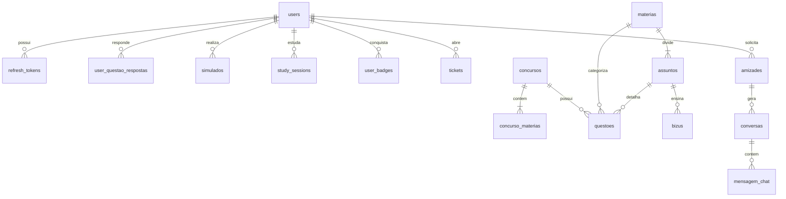
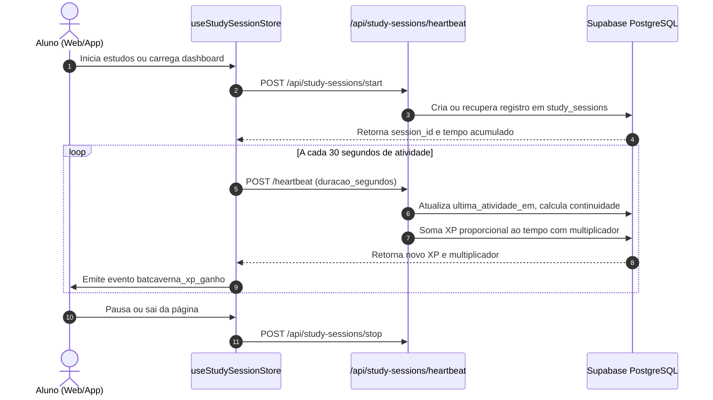
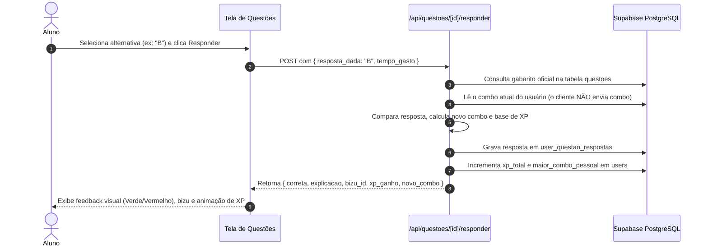

# 🦇 BatCaverna — Central de Operações de Concursos Militares e ENEM

> **Manual Definitivo de Arquitetura, Engenharia e Operação da Plataforma.**  
> Este documento foi elaborado para que qualquer desenvolvedor ou ferramenta de IA entenda profundamente o projeto desde o primeiro contato, evitando equívocos arquiteturais e garantindo desenvolvimento consistente e seguro.

---

## 🚨 Versão 2.6.0 — leia antes de rodar

Se você está subindo o projeto depois da atualização 2.6.0, a ordem é:

```bash
npm install                                  # requer Node.js >= 20
cp apps/web/.env.example apps/web/.env.local # e preencha as credenciais
```

Depois, no **SQL Editor do Supabase**, siga
[`supabase/seeds/LEIA-ME.md`](./supabase/seeds/LEIA-ME.md):

1. `supabase/migrations/004_plataforma_completa.sql` — schema da 2.0
2. `supabase/migrations/005_estudo_inteligente.sql` — revisão espaçada, caderno de erros, distratores e cronograma
3. `supabase/migrations/006_moderacao_contas.sql` — suspender/desativar conta pelo painel
4. `supabase/migrations/007_editais_e_assuntos.sql` — edital de cada concurso e assuntos cobrados
5. `supabase/migrations/008_seguranca_rls.sql` — **obrigatória**: fecha o gabarito, que era legível por qualquer visitante com a chave anônima
6. `supabase/migrations/009_simulados_e_gabaritos.sql` — `tem_comentario`, ano-base do concurso e frases motivacionais
7. `supabase/migrations/010_alertas_moderacao.sql` — alerta de moderação do chat
8. `supabase/migrations/011_taxonomia_assuntos.sql` — **unifica 2.452 assuntos em 515** (rode depois dos seeds de questões)
9. `supabase/migrations/012_escudo_streak_e_simulados.sql` — escudo de sequência
10. `supabase/migrations/013_taf_treino.sql` — diário de treino do TAF
11. `supabase/migrations/014_teoria_ligada_ao_assunto.sql` — liga teoria ao assunto
12. `supabase/migrations/015_contatos_publicos.sql` — mensagens do formulário público de contato
13. os 12 arquivos de `supabase/seeds/*.sql` do banco de questões (**3.247 publicadas**, de 3.281 extraídas)
14. `teoria_*.sql`, `bizus_01.sql`, `videoaulas_01.sql`, `musicas_01.sql` — conteúdo
15. `versao_2_6_0.sql` — registra a versão exibida no rodapé

> **Atenção à ordem:** a `011` REMAPEIA assuntos já gravados, então precisa
> rodar **depois** dos seeds de questões (item 13). A `014` casa o tema da
> teoria com o nome do assunto, então precisa rodar depois da `011` **e** dos
> seeds de teoria (item 14). Rodar fora de ordem não dá erro — simplesmente
> não faz efeito, que é pior.
>
> **A 2.6.0 não acrescentou migration.** A última é a `015`.
>
> Confira o resultado em **/admin → 🩺 Diagnóstico**: ele diz, migration por
> migration, o que chegou ao banco.

```bash
npm run dev:web
```

### O que mudou de estrutural

| Mudança | Onde | Por quê |
| --- | --- | --- |
| `middleware.ts` → **`proxy.ts`** | `apps/web/src/proxy.ts` | O Next.js 16 depreciou o nome `middleware`; a função exportada agora chama `proxy` |
| 14 layouts → **route group `(privado)`** | `apps/web/src/app/(privado)/layout.tsx` | Cada rota privada tinha o próprio `layout.tsx` montando um AppShell. Eram segmentos irmãos: navegar entre seções desmontava e remontava o AppShell inteiro e perdia todo estado que vivia nele. Agora há um só |
| Autenticação unificada | todas as rotas de API | Cada rota tinha seu próprio helper e 23 delas só liam o header `Authorization`, que nenhuma tela enviava — todas respondiam 401 em silêncio |
| `fetchWithAuth` no front | páginas e componentes | `fetch` puro não renovava o token expirado |
| Gamificação no servidor | `apps/web/src/lib/gamificacao.ts` | XP e combo eram calculados só no navegador e se perdiam ao trocar de página |
| Contagens com `count: 'exact'` | `apps/web/src/lib/contagens.ts` | O PostgREST corta em 1.000 linhas: contar por `.length` passaria a mentir com 3 mil questões |
| **Ciclo da sessão de estudo** | `apps/web/src/lib/sessao-estudo.ts` | A regra de virada (8 h ou mudança de dia) existia só em `/start`, que nunca mais era chamado depois da primeira visita. Agora é fonte única do servidor, usada por `start`, `status` e `heartbeat` — e o heartbeat corta a duração informada pelo cliente no tempo real de relógio |
| **Senha em PBKDF2** | `apps/web/src/lib/auth.ts` | Era SHA-256 de uma volta, sem sal. O formato novo (`pbkdf2$iterações$sal$hash`) cabe no `VARCHAR(255)` existente, então **não houve migration**, e a base migra sozinha no login |
| **Prova de simulado com dono** | `apps/web/src/lib/prova-em-andamento.ts` | O `localStorage` é do navegador, não da conta: em computador compartilhado, o próximo aluno caía na prova do anterior |

### Scripts de manutenção (Python 3)

```bash
python scripts/parse_questoes.py --stats   # relatório de extração das provas
python scripts/parse_questoes.py           # gera scripts/out/questoes.json
python scripts/gerar_seed_sql.py           # gera supabase/seeds/*.sql
python scripts/checar_imports.py           # confere imports quebrados sem tsc
python scripts/auditar_gabaritos.py        # integridade dos gabaritos
python scripts/checar_hash_senha.py        # formato do hash de senha e migração
```

---

## 📑 Sumário

1. [Visão Geral do Projeto](#-visão-geral-do-projeto)
2. [Arquitetura Geral do Monorepo](#-arquitetura-geral-do-monorepo)
3. [Pacotes Compartilhados (`packages/`)](#-pacotes-compartilhados-packages)
4. [Frontend Web (`apps/web`)](#-frontend-web-appsweb)
5. [Backend, Autenticação e APIs](#-backend-autenticação-e-apis)
6. [Banco de Dados e Migrações (`supabase/`)](#-banco-de-dados-e-migrações-supabase)
7. [Aplicativo Mobile (`apps/mobile`)](#-aplicativo-mobile-appsmobile)
8. [Fluxos de Dados e Ciclos de Vida](#-fluxos-de-dados-e-ciclos-de-vida)
9. [Variáveis de Ambiente](#-variáveis-de-ambiente)
10. [Guia Passo a Passo: Instalação e Execução](#-guia-passo-a-passo-instalação-e-execução)
11. [🛡️ Guia Anti-Erros / Regras de Ouro](#️-guia-anti-erros--regras-de-ouro-para-devs-e-ias)

---

## 🎯 Visão Geral do Projeto

A **BatCaverna** é uma plataforma de estudos gamificada, imersiva e de alta performance, projetada para estudantes que prestam concursos militares de elite e o ENEM:

- 🛩️ **Aeronáutica**: EEAR (Sargentos Especialistas), EPCAR (Cadetes do Ar)
- ⚓ **Marinha**: EAM (Aprendizes-Marinheiros), Colégio Naval (CN), EFOMM (Oficiais da Marinha Mercante)
- ⚔️ **Exército**: ESA (Sargentos das Armas), EsPCEx (Cadetes do Exército), IME (Engenharia Militar)
- 🎓 **ENEM**: Exame Nacional do Ensino Médio (todas as áreas do conhecimento)

### Pilares da Plataforma
- **Gamificação Militar**: 15 patentes/níveis (de *Recruta das Sombras* a *Rei da Batcaverna*), XP contínuo, combos de acertos, badges e rankings semanais/mensais/gerais.
- **Sessões de Estudo em Tempo Real**: Rastreador de tempo ativo de estudo com cálculo de continuidade, multiplicador de dedicação e envio de heartbeats sincronizados ao banco.
- **Banco de Questões e Bizus**: Resolução interativa com gabarito comentado, bizus táticos associados e relatórios de desempenho por matéria.
- **Simulados Cronometrados**: Geração automática de provas com correção em lote e blindagem de gabarito até a finalização.
- **Comunidade & Squad**: Busca de soldados, pedidos de amizade, chat em tempo real e mini-perfis customizáveis com badges e banners.
- **Painel Administrativo**: Gestão de usuários, armazém de ingestão automática de questões com deduplicação por hash SHA-256 e auditoria de moderação.

---

## 🏗️ Arquitetura do Monorepo

O projeto é configurado como um **Monorepo** gerenciado por **Turborepo** e **NPM Workspaces** (`apps/*`, `packages/*`).

```
batcaverna/
├── apps/
│   ├── web/                     # Aplicação Web (Next.js 16 App Router + React 19)
│   └── mobile/                  # Aplicativo Nativo Android (Bare React Native 0.74.5)
├── packages/
│   ├── types/                   # Contratos TypeScript, entidades e enums do domínio
│   ├── ui/                      # Design Tokens (paleta BatCaverna, forças militares, níveis)
│   ├── utils/                   # Cálculos de XP, combos, formatadores de data/tempo e validações
│   └── config/                  # tsconfig.base.json e regras compartilhadas
├── supabase/
│   └── migrations/              # Scripts SQL (Schema mestre, seeds e políticas RLS)
├── turbo.json                   # Configuração de pipelines do Turborepo
└── package.json                 # Orquestrador de dependências e scripts do monorepo
```

---

## 📦 Pacotes Compartilhados (`packages/`)

Os pacotes em `packages/` são compilados diretamente pelo TypeScript e consumidos pelos apps via workspaces locais:

### 1. `@batcaverna/types` (`packages/types`)
Contém todos os contratos de dados compartilhados entre frontend, backend e mobile:
- **Enums**: `UserRole`, `Forca`, `NivelEnsino`, `NivelImpacto`, `Dificuldade`, `ProgressoStatus`, `RankingPeriodo`, `TicketStatus`, `NotificacaoTipo`, etc.
- **Interfaces de Domínio**: `User`, `UserMiniPerfil`, `Concurso`, `Materia`, `Assunto`, `Questao`, `Simulado`, `Bizu`, `StudySession`, `RankingEntry`, `Ticket`, etc.
- **Contratos de Resposta da API**: `ApiResponse<T>`, `AuthTokens`, `PaginatedResponse<T>`.

### 2. `@batcaverna/ui` (`packages/ui`)
Define os **Design Tokens** universais da marca BatCaverna:
- **Cores Oficiais**:
  - Fundo escuro primário: `#0B0B0F`, `#121218`, `#16161E` (cards), `#1E1E28` (elevado).
  - Amarelo-ouro BatCaverna: `#F5C518` (destaques, badges, botões táticos).
  - Cores por Força: Aeronáutica (`#0047AB`), Marinha (`#0A2540`), Exército (`#2E5A1E`), ENEM (`#E65100`).
- **Níveis de Gamificação**: Tabela de 15 níveis com títulos e pisos mínimos de XP.

### 3. `@batcaverna/utils` (`packages/utils`)
Funções puras e determinísticas para regras de negócio:
- **Gamificação**: `calcularNivel(xp)`, `calcularXpQuestao(acertou, combo)`, `calcularBonusCombo(combo)`.
- **Formatação**: `formatarTempoEstudo(segundos)`, `formatarCronometro(segundos)`, `formatarDataHoraVersao(isoDate)`.
- **Validação**: `validarEmail(email)`, `validarSenha(senha)`, `validarApelido(apelido)`.
- **Deduplicação**: `normalizarTextoParaHash(str)` para evitar questões duplicadas no armazém.

### 4. `@batcaverna/config` (`packages/config`)
Configurações TypeScript estendidas (`tsconfig.base.json`).

---

## 🌐 Frontend Web (`apps/web`)

### Stack Tecnológica
- **Framework**: [Next.js 16.3+](https://nextjs.org/) (App Router, Turbopack)
- **Biblioteca Core**: [React 19](https://react.dev/)
- **Estilização**: [Tailwind CSS v4](https://tailwindcss.com/) (`@tailwindcss/postcss`)
- **Gerenciamento de Estado**: [Zustand 5](https://zustand-demo.pmnd.rs/) com persistência em `localStorage`
- **Componentes & Animações**: nenhuma biblioteca de UI em uso. Os gráficos
  (evolução semanal, simulados, TAF) são SVG escrito à mão — são poucas
  dezenas de pontos e uma linha; um pacote de gráficos pesaria mais que a
  página inteira.

> [!NOTE]
> `lucide-react`, `framer-motion` e `recharts` estão declaradas em
> `apps/web/package.json` e **não são importadas em nenhum arquivo**
> (verificado em 07/09/2026). São peso morto no `npm install` e na superfície
> de `npm audit`.
- **Criptografia & JWT**: `jose`

### Mapa de Rotas e Páginas
```
apps/web/src/app/
├── page.tsx                     # Landing Page pública com apresentação e atalho de acesso
├── auth/page.tsx                # Central de Autenticação (Login, Cadastro, Recuperação de Senha)
├── (privado)/                   # ROUTE GROUP: um único layout.tsx monta o AppShell
│   │                            #  para toda a área logada (não aparece na URL)
│   ├── dashboard/page.tsx       # "Plano de Hoje": o que estudar agora, radar de fraqueza
│   ├── concursos/page.tsx       # Catálogo de Concursos Militares e seleção de foco
│   ├── concursos/[sigla]/       # trilha · assuntos · estatísticas · TAF
│   ├── questoes/page.tsx        # Banco Interativo de Questões com filtros dinâmicos
│   ├── simulado/page.tsx        # Prova cronometrada; sobrevive a recarregar a página
│   ├── ranking/page.tsx         # Hall da Fama (Geral, Semanal, Mensal e por Concurso)
│   ├── bizus/page.tsx           # Anotações táticas, fórmulas e resumos de alto impacto
│   ├── chat/page.tsx            # Comunicação entre soldados e conversas diretas
│   ├── tickets/page.tsx         # Central de Suporte e reporte de inconsistências
│   ├── perfil/page.tsx          # Estatísticas do estudante, edição de perfil e banner
│   ├── progresso/page.tsx       # Histórico: streak, tempo, XP, evolução e simulados
│   ├── caderno/page.tsx         # Caderno de erros com anotação por questão
│   ├── revisoes/page.tsx        # Fila da repetição espaçada
│   ├── cronograma/page.tsx      # Plano de estudo por semana até a data da prova
│   ├── musica/page.tsx          # Acervo de música, favoritos e playlists
│   └── admin/                   # Painel Administrativo (usuários, moderação, armazém)
├── termos/                      # Termos de Uso
├── privacidade/                 # Política de Privacidade (LGPD)
└── contato/                     # Canal de contato oficial
```

### Gerenciamento de Estado Global (Stores)
1. **`useAuthStore`** (`src/stores/auth-store.ts`):
   - Mantém usuário ativo, `accessToken` e `refreshToken`.
   - Persiste sessão em `localStorage` sob a chave `'batcaverna-auth'`.
   - Fornece o helper **`fetchWithAuth(url, options)`**: intercepta qualquer resposta `401 Unauthorized`, solicita um novo token via `/api/auth/refresh` silenciosamente e repete a chamada sem deslogar o usuário.
2. **`useStudySessionStore`** (`src/stores/study-session-store.ts`):
   - Gerencia o cronômetro de estudo ativo.
   - Envia `heartbeat` periódico para `/api/study-sessions/heartbeat`.
   - Atualiza multiplicadores de continuidade e incrementa XP em tempo real.
   - Dispara eventos customizados no navegador: `batcaverna_xp_ganho` e `batcaverna_level_up`.

### Proteção de Rotas com Middleware (`src/proxy.ts`)
O proxy do Next.js (antigo middleware) intercepta todas as rotas protegidas (`/dashboard`, `/questoes`, `/simulado`, `/admin`, etc.):
- Lê o token via cookie `bat_access_token` ou header `Authorization: Bearer <token>`.
- Valida o token com `verifyAccessToken(token)`.
- Se o token for inválido/inexistente, redireciona para `/auth?redirect=<rota>`.
- Para rotas `/admin`, valida se o claim `role === 'admin'`.

---

## 🔒 Backend, Autenticação e APIs

> [!CAUTION]
> **AVISO CRÍTICO SOBRE AUTENTICAÇÃO:**
> O projeto **NÃO UTILIZA** o serviço de Auth padrão do Supabase (GoTrue/`supabase.auth`).
> A autenticação é **100% customizada**, gerenciada pela própria API Next.js e armazenada na tabela `users` do PostgreSQL.
> **NUNCA** chame `supabase.auth.signInWithPassword()` ou `supabase.auth.signUp()`.

### Arquitetura de Autenticação (`src/lib/auth.ts`)
- **Armazenamento de Senha**: **PBKDF2-HMAC-SHA256**, 210.000 iterações, sal
  por usuário, via Web Crypto (`crypto.subtle.deriveBits`). Guardado em
  `users.senha_hash` no formato auto-descritivo
  `pbkdf2$<iterações>$<sal>$<derivado>` — cabe no `VARCHAR(255)` que já
  existia, por isso não houve migration. O formato antigo (SHA-256 de uma
  volta, sem sal) ainda é aceito no login e **regravado no formato novo na
  hora**: a base migra sozinha, sem pedir nada ao aluno. Comparação em tempo
  constante nos dois casos.
- **Access Token (JWT)**: Emitido via biblioteca `jose` (`HS256`), assinado com `JWT_SECRET`, com duração padrão de **10 horas** (36.000s) para garantir estudo ininterrupto.
- **Refresh Token**: Gerado aleatoriamente com bytes criptográficos, armazenado com hash na tabela `refresh_tokens` e vinculado ao cookie seguro HTTP-only `bat_refresh_token`.
- **Compatibilidade Dupla**: Suporta Cookies (ideal para SSR e páginas web) e Headers Bearer (ideal para clientes mobile e chamadas client-side).

### Padrão dos Clientes Supabase (`src/lib/supabase.ts`)
O backend adota duas instâncias de conexão com o banco de dados:

1. **`createServerSupabaseClient()`** (Uso exclusivo nas API Routes):
   - Utiliza a **`SUPABASE_SERVICE_ROLE_KEY`**.
   - Bypassa as políticas de RLS no nível do banco.
   - Permite que as rotas da API executem leitura e escrita de forma segura após validar a permissão do usuário via JWT.
2. **`createBrowserSupabaseClient()`** (Uso client-side):
   - Utiliza a **`NEXT_PUBLIC_SUPABASE_ANON_KEY`**.
   - Respeita estritamente o Row Level Security (RLS) habilitado no banco.

### Catálogo de Rotas de API (`apps/web/src/app/api/`)
| Rota | Método | Descrição | Permissão |
| :--- | :--- | :--- | :--- |
| `/api/auth/login` | POST | Autentica e-mail/senha, retorna tokens e grava cookies | Pública |
| `/api/auth/register` | POST | Registra novo soldado, valida unicidade de e-mail e apelido | Pública |
| `/api/auth/refresh` | POST | Emite novo access_token usando refresh_token válido | Pública |
| `/api/auth/logout` | POST | Revoga tokens e limpa cookies de sessão | Autenticado |
| `/api/auth/recuperar` | POST | Gera link de recuperação de senha por e-mail | Pública |
| `/api/usuarios/me` | GET / PATCH | Consulta e atualiza dados do perfil do usuário logado | Autenticado |
| `/api/usuarios/[id]/mini-perfil`| GET | Retorna cartão público resumido de qualquer soldado | Autenticado |
| `/api/concursos` | GET | Lista todos os concursos militares e matérias | Pública |
| `/api/questoes` | GET | Consulta questões paginadas com filtros (banca, ano, matéria) | Pública |
| `/api/questoes/[id]/responder` | POST | Valida resposta, calcula XP, atualiza combo e salva histórico | Autenticado |
| `/api/simulados/start` | POST | Cria simulado e retorna questões (com gabarito ocultado) | Autenticado |
| `/api/simulados/[id]/finalizar`| POST | Corrige prova em lote, calcula acertos, pontuação e concede XP | Autenticado |
| `/api/study-sessions/start` | POST | Abre uma sessão ativa de estudo cronometrada | Autenticado |
| `/api/study-sessions/heartbeat`| POST | Sincroniza segundos estudados, calcula multiplicador e soma XP | Autenticado |
| `/api/study-sessions/stop` | POST | Finaliza a sessão atual de estudo | Autenticado |
| `/api/ranking` | GET | Tabela de líderes; respeita `ocultar_do_ranking` e filtra por concurso | Autenticado |
| `/api/amizades/solicitar` | POST | Envia solicitação de amizade entre soldados | Autenticado |
| `/api/chat/mensagens` | GET / POST | Envia e lista mensagens privadas entre amigos | Autenticado |
| `/api/tickets` | GET / POST | Criação e acompanhamento de tickets de suporte | Autenticado |
| `/api/tickets/[id]` | GET | Um chamado com a conversa inteira. **Não existia**: quatro telas a chamavam e recebiam 404, então ninguém conseguia ler nem responder um chamado | Dono ou Admin |
| `/api/admin/usuarios` | GET / PATCH | Gestão administrativa de usuários e permissões | Admin |
| `/api/admin/questoes/importar` | POST | Prévia e importação de um `.txt` de prova, com deduplicação por hash SHA-256 | Admin |
| `/api/admin/moderacao` | GET / PUT | Fila de mensagens sinalizadas do chat e registro da decisão | Admin |
| `/api/admin/saude` | GET | Diagnóstico da instalação: confere se cada migration chegou ao banco | Admin |
| `/api/contato` | POST | Formulário público de contato: grava em `contatos_publicos` e notifica os administradores | Pública (3/15min por IP) |
| `/api/admin/contatos` | GET / PATCH | Mensagens do formulário público, com marcação de lida e respondida | Admin |
| `/api/admin/auditoria` | GET | Relatório de auditoria de ações administrativas | Admin |

---

## 🗄️ Banco de Dados e Migrações (`supabase/`)

O banco de dados é um PostgreSQL hospedado no Supabase.

### Como aplicar as migrações:
Para subir o banco completo de uma só vez em um novo ambiente Supabase:
1. Acesse o **SQL Editor** no painel do Supabase.
2. Copie o conteúdo integral do arquivo **`supabase/migrations/000_setup_completo_batcaverna.sql`**.
3. Execute o script. Ele é idempotente e realiza:
   - Habilitação das extensões (`uuid-ossp`, `pgcrypto`).
   - Criação de todos os Enums (`user_role`, `forca_tipo`, `dificuldade_tipo`, etc.).
   - Criação das 25+ tabelas com Foreign Keys e Índices de busca rápida.
   - Criação de Triggers de atualização automática de timestamp.
   - Inserção de Seed Data (9 concursos, 15 matérias, dezenas de assuntos, 15 patentes de XP e usuário Administrador padrão).
   - Ativação de Row Level Security (RLS) e políticas de leitura pública.

### Tabelas Principais do Domínio
> **Legado:** `user_progresso`, `concurso_assuntos`, `nivel_gamificacao`,
> `ranking_cache`, `tipos_armadilha` e a view `users_bloqueados` existem no
> schema e **nenhuma linha de código as lê ou escreve** (verificado em
> 07/09/2026). São restos de abordagens substituídas. Ficam por serem
> inofensivas; removê-las seria destrutivo e sem ganho.



### Administrador Padrão (Seed):
> [!WARNING]
> Este e-mail está no seed e, portanto, num repositório público. Se o
> repositório for tornado privado, isto deixa de ser exposição; enquanto não
> for, considere trocar por um endereço de serviço.

- **E-mail**: `raf4biel.venafro@gmail.com`
- **Apelido**: `AdminCaverna`
- **Role**: `admin`
- **Nível inicial**: 15 (Rei da Batcaverna, 25.000 XP)

---

## 📱 Aplicativo Mobile (`apps/mobile`)

### Arquitetura Híbrida
O aplicativo mobile **não utiliza Expo gerenciado**, sendo um projeto **Bare React Native 0.74.5** nativo com pasta `android/` configurada. Ele atua como um wrapper otimizado da plataforma:

1. **WebView de Alta Performance (`react-native-webview`)**:
   - Aponta por padrão para a aplicação Web (`PLATFORM_URL = "https://estudo-tan.vercel.app"`).
   - Em desenvolvimento local, pode ser alterado para o IP da sua máquina na rede local (ex: `http://192.168.x.x:3000`).
2. **Injeção de JavaScript (`INJECTED_JAVASCRIPT`)**:
   - Injeta antes do carregamento da página:
     ```javascript
     window.IS_BATCAVERNA_MOBILE_APP = true;
     window.ReactNativeWebView = window.ReactNativeWebView || {};
     ```
   - **A intenção era permitir que o web detectasse o app e adaptasse a
     interface — mas nenhum arquivo de `apps/web/src` lê essas variáveis**
     (verificado em 07/09/2026). Hoje a injeção não tem efeito.
3. **Resiliência e Fallback Offline**:
   - Protegido por um `ErrorBoundary` nativo no topo da árvore de componentes, evitando crash total do app.
   - Tratamento de falhas de conexão de rede com tela customizada e botão "Tentar Novamente ⚡".
4. **Integração com Sistema Operacional**:
   - Suporte ao botão de voltar físico do Android (`BackHandler.addEventListener('hardwareBackPress')`).
   - Interceptação de links de protocolos externos (`whatsapp:`, `tel:`, `mailto:`, `market:`) via `Linking.openURL()`.
5. **Geração do APK Release**:
   - Compilação nativa via Gradle: `npm run build:apk`.
   - Gera o binário otimizado em `apps/mobile/android/app/build/outputs/apk/release/app-release.apk`.

---

## 🔄 Fluxos de Dados e Ciclos de Vida

### 1. Fluxo de Sessão de Estudo e Heartbeat


### 2. Fluxo de Resolução de Questão


---

## ⚙️ Variáveis de Ambiente

Crie o arquivo **`apps/web/.env.local`** baseado no exemplo fornecido em `apps/web/.env.example`:

```bash
cp apps/web/.env.example apps/web/.env.local
```

| Variável | Obrigatória? | Descrição | Exemplo |
| :--- | :---: | :--- | :--- |
| `NEXT_PUBLIC_SUPABASE_URL` | Sim | URL base do seu projeto Supabase | `https://xyz.supabase.co` |
| `NEXT_PUBLIC_SUPABASE_ANON_KEY` | Sim | Chave pública anônima (com RLS) | `eyJhbGciOi...` |
| `SUPABASE_SERVICE_ROLE_KEY` | Sim | Chave de serviço administrativa (bypassa RLS nas APIs) | `eyJhbGciOi...` |
| `JWT_SECRET` | Sim | Chave secreta usada para assinar e validar tokens JWT | `minha_chave_super_secreta_jwt` |
| `JWT_ACCESS_EXPIRATION` | Não | Duração em segundos do token de acesso (Padrão: 36000 = 10h) | `36000` |
| `JWT_REFRESH_EXPIRATION`| Não | Duração em segundos do refresh token (Padrão: 36000 = 10h) | `36000` |
| `NEXT_PUBLIC_APP_URL` | Sim | URL raiz da aplicação Web para redirecionamentos | `http://localhost:3000` |
| `RESEND_API_KEY` | Não | Chave de API do Resend para envio de e-mails transacionais | `re_123456789` |
| `EMAIL_FROM` | Não | Remetente dos e-mails disparados pela plataforma | `noreply@batcaverna.com.br` |
| `UPSTASH_REDIS_REST_URL` | Não | Instância Redis para rate limiting e cache do ranking | `https://...` |
| `UPSTASH_REDIS_REST_TOKEN` | Não | Token de autenticação da REST API do Upstash | `...` |

> [!CAUTION]
> **`apps/web/src/lib/supabase.ts` tem a URL, a anon key e a `service_role`
> escritas no código.** Não é um "fallback de demonstração": é a credencial
> do projeto de produção, num repositório público.
>
> Pior: a função que decide entre a env var e o valor fixo faz
> `envServiceKey.includes('service_role')`. Essa string **nunca aparece
> literalmente num JWT do Supabase** — o payload é base64. A condição é
> sempre falsa, então **a env var `SUPABASE_SERVICE_ROLE_KEY` é ignorada e o
> código sempre usa a chave do arquivo**.
>
> Consequência prática: **rotacionar a chave no Supabase derruba a
> plataforma**, porque o código continuará enviando a chave revogada.
> A ordem correta é remover o valor fixo e configurar a env var no MESMO
> deploy, e só então rotacionar. Veja `SEGURANCA-ACOES-MANUAIS.txt`.

> [!CAUTION]
> `JWT_SECRET` tem fallback `'dev-secret-change-me'` em
> `apps/web/src/lib/auth.ts`. Se a variável não estiver definida no ambiente,
> qualquer pessoa que leia este repositório público pode assinar um token com
> `role: 'admin'` e entrar no painel. **Confirme que ela está configurada na
> Vercel antes de qualquer outra coisa.**

---

## 🚀 Guia Passo a Passo: Instalação e Execução

### Pré-requisitos
- **Node.js**: Versão `>= 20.0.0`
- **NPM**: Versão `>= 10.0.0`
- **Git**
- *(Opcional - Apenas se for compilar o APK Android localmente)*: JDK 17 ou 21 e Android SDK configurado com a variável de ambiente `ANDROID_HOME`.

---

### 1. Clonar e Instalar Dependências
Na raiz do monorepo (`batcaverna/`):
```bash
npm install
```
Isso instalará as dependências de todos os workspaces (`apps/web`, `apps/mobile`, `packages/*`).

---

### 2. Configurar o Banco de Dados (Supabase)
1. Acesse o seu projeto no console do [Supabase](https://supabase.com).
2. Abra o **SQL Editor**.
3. Abra o arquivo `supabase/migrations/000_setup_completo_batcaverna.sql` deste repositório, copie todo o conteúdo, cole no editor e clique em **Run**.
4. Verifique se as 25+ tabelas e dados iniciais foram criados no **Table Editor**.

---

### 3. Configurar as Variáveis de Ambiente
Copie o arquivo de exemplo e insira suas credenciais:
```bash
cp apps/web/.env.example apps/web/.env.local
```

---

### 4. Executar a Aplicação Web (Next.js)
```bash
npm run dev:web
```
Acesse a aplicação no navegador em [http://localhost:3000](http://localhost:3000).

---

### 5. Executar o Aplicativo Mobile (React Native / Android)
Para iniciar o Metro Bundler do aplicativo mobile:
```bash
npm run dev:mobile
```
Para inicializar o app diretamente no emulador ou dispositivo Android conectado via USB:
```bash
cd apps/mobile
npm run android
```

---

### 6. Compilar o APK Release do Android
Para gerar o pacote de instalação final `.apk`:
```bash
npm run build:apk
```
O arquivo gerado estará disponível em:
`apps/mobile/android/app/build/outputs/apk/release/app-release.apk`

---

## 🛡️ Guia Anti-Erros / Regras de Ouro para Devs e IAs

Siga rigorosamente estas diretrizes para não quebrar a arquitetura do projeto:

> ### 1. NUNCA utilize Supabase Auth
> O projeto utiliza autenticação própria com JWT (`jose`) e senhas com hash SHA-256 na tabela `users`. Métodos como `supabase.auth.signInWithPassword`, `supabase.auth.getUser` ou `@supabase/auth-helpers` **NÃO FUNCIONAM** neste ecossistema. Utilize sempre os endpoints `/api/auth/*`.

> ### 2. No Next.js 16, SEMPRE aguarde `params` com `await`
> No Next.js 16 App Router, os parâmetros de rotas dinâmicas são Promises:
> ```typescript
> // ❌ ERRADO (gera erro em runtime):
> export async function GET(req: NextRequest, { params }: { params: { id: string } }) {
>   const id = params.id;
> }
> 
> // ✅ CORRETO:
> export async function GET(req: NextRequest, { params }: { params: Promise<{ id: string }> }) {
>   const { id } = await params;
> }
> ```

> ### 3. Rotas de API devem usar `createServerSupabaseClient()`
> Todas as tabelas do Supabase possuem RLS ativado. As rotas internas de API (`src/app/api/**`) **devem** chamar `createServerSupabaseClient()` para usar a chave de serviço (`service_role`). Se usar o cliente do browser no servidor, as operações de escrita serão bloqueadas pelo RLS.

> ### 4. Chamadas autenticadas no Client devem usar `fetchWithAuth()`
> No frontend web, quando precisar fazer requisições a rotas privadas, importe e use `fetchWithAuth` de `@/stores/auth-store`. Ele anexa o header `Authorization: Bearer <token>` e renova automaticamente o token de acesso caso expire.

> ### 5. Não quebre as fronteiras do Monorepo
> Se você precisar de um novo tipo TypeScript, adicione-o em `packages/types/src/index.ts`. Se precisar de uma nova função matemática ou utilitária, adicione-a em `packages/utils/src/index.ts`. Nunca duplique código entre `web` e `mobile`.

> ### 6. Blindagem de Gabarito em Simulados
> Ao criar ou listar questões durante um simulado ativo (`/api/simulados/start`), **nunca envie os campos `resposta_correta` ou `explicacao` para o frontend**. O gabarito só deve ser consultado no servidor no momento em que o aluno finalizar a prova (`/api/simulados/[id]/finalizar`).

> ### 7. Compilação do Android (`gradle.properties`)
> Se compilar o APK em uma nova máquina, verifique a propriedade `org.gradle.java.home` no arquivo `apps/mobile/android/gradle.properties`. Se o caminho do JDK apontar para uma pasta de outro usuário, comente essa linha ou aponte para o seu próprio JDK instalado.

---

### 🦇 BatCaverna — Rumo à Aprovação!
*Dúvidas, sugestões de novos concursos ou problemas técnicos? Abra um Ticket na aba de Suporte da plataforma.*
